# Call Graph (Function-Level)

Requirement note: you must **draw the final call graph by hand** for submission. This file provides the *exact nodes/edges* to copy into a hand-drawn diagram.

## Inter-module call list (key edges)

- `cli.main` → `registration.register_member`
- `cli.main` → `crew_management.assign_role`
- `cli.main` → `crew_management.set_skill`
- `cli.main` → `inventory.add_car`
- `cli.main` → `inventory.add_cash`
- `cli.main` → `race_management.create_race`
- `cli.main` → `race_management.enter_race`
- `cli.main` → `race_management.run_race`
- `cli.main` → `mission_planning.create_mission`
- `cli.main` → `mission_planning.start_mission`
- `StreetRaceManager.audit` → `audit_log.log_event`

- `crew_management.is_available_for_role` → (iterates over `CrewMember` objects)

- `race_management.enter_race` → `crew_management.get_role`
- `race_management.run_race` → `results.record_result`
- `race_management.run_race` → `results.update_rankings`
- `race_management.run_race` → `results.award_prize`
- `results.award_prize` → `inventory.remove_cash`

- `mission_planning.can_start_mission` → `crew_management.is_available_for_role`
- `mission_planning.start_mission` → `mission_planning.can_start_mission`

- `maintenance.damage_car` → (mutates `Car.condition`)
- `maintenance.repair_car` → (mutates `Car.condition`)

## Mermaid reference (optional)

You can use this to visually verify correctness before drawing by hand.

```mermaid
flowchart TD
  cli_main[cli.main]
  reg_register[registration.register_member]
  crew_assign[crew_management.assign_role]
  crew_skill[crew_management.set_skill]
  inv_addcar[inventory.add_car]
  inv_addcash[inventory.add_cash]
  race_create[race_management.create_race]
  race_enter[race_management.enter_race]
  race_run[race_management.run_race]
  res_record[results.record_result]
  res_rank[results.update_rankings]
  res_prize[results.award_prize]
  inv_remcash[inventory.remove_cash]
  mission_create[mission_planning.create_mission]
  mission_start[mission_planning.start_mission]
  mission_can[mission_planning.can_start_mission]
  crew_role[crew_management.get_role]
  crew_avail[crew_management.is_available_for_role]
  audit[StreetRaceManager.audit]
  log[audit_log.log_event]

  cli_main --> reg_register
  cli_main --> crew_assign
  cli_main --> crew_skill
  cli_main --> inv_addcar
  cli_main --> inv_addcash
  cli_main --> race_create
  cli_main --> race_enter
  cli_main --> race_run
  cli_main --> mission_create
  cli_main --> mission_start

  audit --> log

  race_enter --> crew_role
  race_run --> res_record
  race_run --> res_rank
  race_run --> res_prize
  res_prize --> inv_remcash

  mission_start --> mission_can
  mission_can --> crew_avail
```

